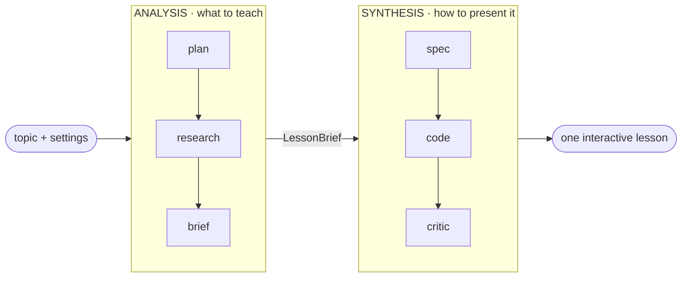
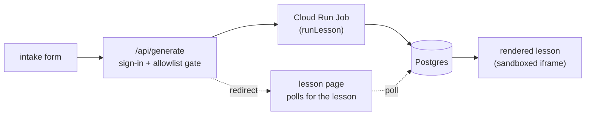

# Topic Synthesis

Generate an interactive, scaffolded lesson from a topic.

You enter a topic + settings; a two-component **ANALYSIS → SYNTHESIS** workflow researches the topic and synthesizes a standalone, interactive HTML/Canvas/SVG/JS **lesson** — modeled on hand-built explorable explanations. Today the workflow produces one excellent lesson end-to-end (the de-risking milestone); assembling many into a tiered, prerequisite-scaffolded curriculum is the roadmap. <!-- concept-drift-ok: roadmap north-star (the curriculum WRAPPER), not a present-tense product claim — INSTANCE.md "Product concept" + ADR-0003 -->

## Status

**The single-lesson pipeline is built and deployed.** Bootstrapped from the [`agentic-seed`](https://github.com/julianken/agentic-seed) template; the full ANALYSIS → SYNTHESIS workflow runs auth-gated on GCP (Cloud Run Service + Job, Cloud SQL, Identity Platform) and generates one interactive lesson from a topic. The tiered-curriculum *wrapper* over this workflow is the next sub-project. <!-- concept-drift-ok: roadmap north-star (the curriculum WRAPPER), not a present-tense product claim — ADR-0003 --> See [`docs/plans/`](./docs/plans/), [`docs/decisions/`](./docs/decisions/), and [`docs/research/`](./docs/research/).

## How a lesson is generated

Two components meet at one typed contract, the `LessonBrief`: **Analysis** decides *what to teach* (grounded in web research); **Synthesis** decides *how to present it* as one interactive page.



A run is dispatched to a scale-to-zero Cloud Run Job behind a sign-in + allowlist gate; the browser polls until the lesson lands, then renders it in a sandboxed iframe:



**Deeper:** [`src/pipeline/README.md`](./src/pipeline/README.md) — the stage-by-stage flow with data contracts, the request/deploy sequence, the degrade-to-`soon` + crash-resume behavior, and the swap-seam architecture.

- **Eval & observability:** offline evals + trace inspection via [`@eleatic/eval`](https://github.com/julianken/eleatic), a co-developed sibling toolkit (under `--trace`, an LLM judge scores the `LessonBrief`); production telemetry is a later sub-project.
- **Foundation:** the reviewed-PR process, design source-of-truth, and CI come from the `agentic-seed` template — see [`AGENTS.md`](./AGENTS.md), [`INSTANCE.md`](./INSTANCE.md), and [`DESIGN.md`](./DESIGN.md).

## Repository

Built largely by AI coding agents through reviewed, squash-merged PRs. Process and conventions live in [`AGENTS.md`](./AGENTS.md).

## Develop

```sh
cp .env.example .env        # adjust if needed
docker compose up -d        # Postgres + Redis
npm install
npm run db:migrate          # apply src/store/schema.sql
npm run typecheck && npm test
npm run dev                 # http://localhost:3000
```

Node ≥ 20. Full command list + module layout in [`AGENTS.md`](./AGENTS.md) → "Working in the tree".

## License

MIT — see [`LICENSE`](./LICENSE).
