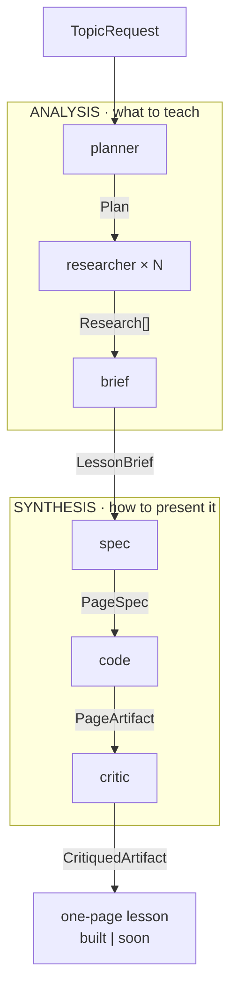
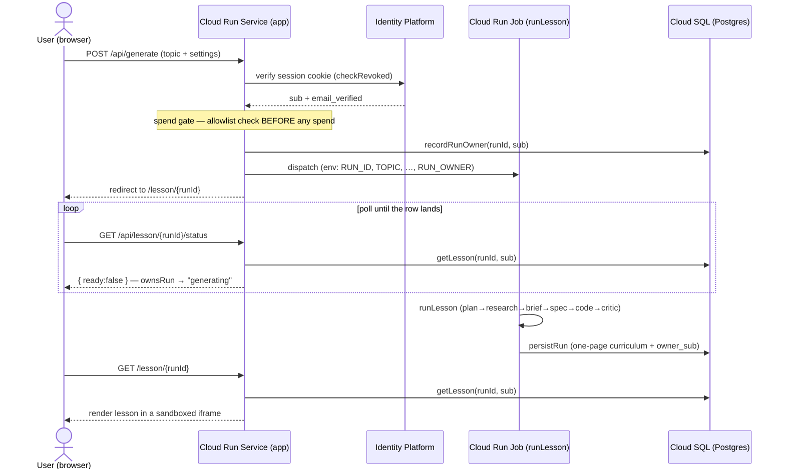
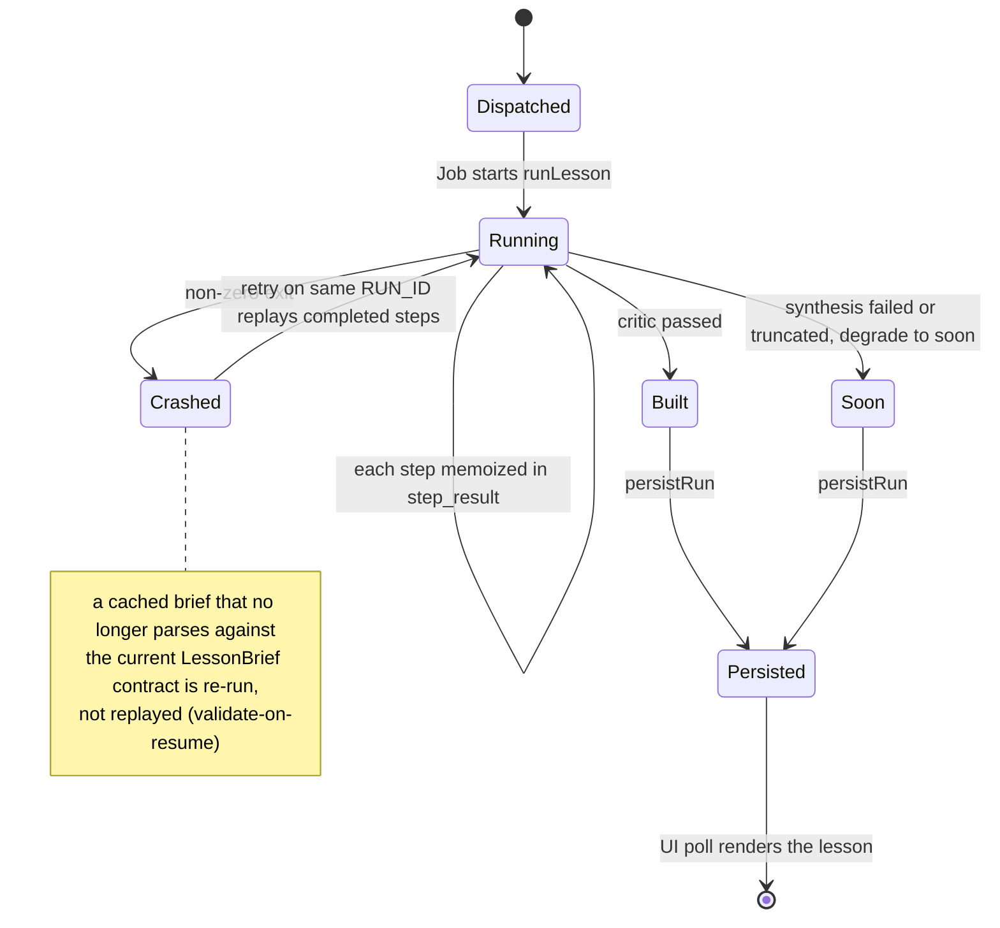
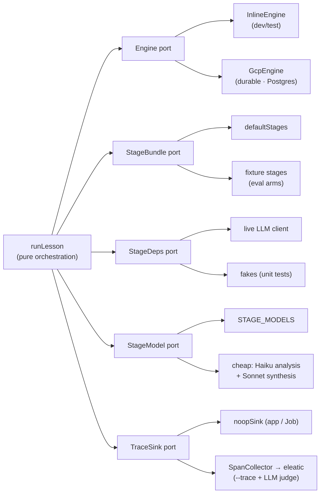

# `src/pipeline/` — how a lesson is generated

This directory is the engine room: the stages and orchestration that turn a **topic + settings** into **one interactive learning lesson**. It is pure, Next-free, and driven over injected ports, so every piece is unit-testable and swappable (see [Swap seams](#swap-seams)).

> The product generates **one lesson**, not a curriculum. A curriculum becomes a future *wrapper* over this same workflow (decompose a topic → run the lesson workflow per sub-topic → assemble); the curriculum machinery (`graph`, `coverage-gate`, `hub`) lives here but is **dormant** until then.

## The two components

The pipeline has exactly two conceptual halves — the two dials we tune to improve results — meeting at a single typed contract, the **`LessonBrief`**:

- **ANALYSIS** (`planner` → `researcher` → `brief`) decides **what to teach**, grounded in web research.
- **SYNTHESIS** (`spec` → `code` → `critic`) decides **how to present it** as one standalone interactive page.

The edges are the **data contracts** — the part most likely to drift from the code, so they are the diagram. Each contract is a Zod-validated type in [`../domain/stages.ts`](../domain/stages.ts).

### The stages

| Stage | Component | File | Reads → Writes | Model (default) | Model (`--cheap`) |
|---|---|---|---|---|---|
| `planner` | Analysis | [`planner.ts`](planner.ts) | `TopicRequest` → `Plan` (scope, subtopics, research questions) | Opus | Haiku |
| `researcher` | Analysis | [`researcher.ts`](researcher.ts) | one research question → `Research` (findings + sources); **fanned out**, web-grounded, drops any finding citing a non-retrieved source | Sonnet | Haiku |
| `brief` | Analysis | [`brief.ts`](brief.ts) | `Plan` + `Research[]` → **`LessonBrief`** (learning goal · key points · grounded findings · audience) | Opus | Haiku |
| `spec` | Synthesis | [`spec.ts`](spec.ts) | `LessonBrief` → `PageSpec` (interaction kind, a11y contract) | Sonnet | **Sonnet** |
| `code` | Synthesis | [`code.ts`](code.ts) | `PageSpec` → `PageArtifact` (standalone HTML, ≤32000 tokens) | Sonnet | **Sonnet** |
| `critic` | Synthesis | [`critic.ts`](critic.ts) | `PageArtifact` → `CritiquedArtifact` (pass / fail) | Opus | **Sonnet** |

> **Why synthesis stays on Sonnet even when cheap.** A single lesson *is* its one page. If `code` (the page builder) ran on Haiku, its smaller output budget truncates a rich interactive page → the lesson degrades to `soon` → nothing usable. The cheap profile ([`cheapModels()`](../llm/models.ts)) therefore puts ANALYSIS on Haiku for cost but SYNTHESIS on Sonnet so the lesson reliably builds.

`brief` is the **only** producer of the "what to teach" payload on this path — it replaces `graph` (the curriculum-era producer). `learningGoal` lives *only* on the `LessonBrief`; routing the grounded `findings` through the brief is why `spec` chooses its interaction on real material rather than a bibliography.

The orchestration is [`run-pipeline.ts`](run-pipeline.ts) → `runLesson`: `runAnalysisPrelude` (plan + researcher fan-out, shared with the dormant curriculum path) → `brief` → `synthesizeLesson` (spec → code → critic) → a one-tier/one-page hub. Every LLM call's cost is threaded through; pure stages (`coverage-gate`, `hub`) never call a model.

## The runtime: form → Job → lesson

The pipeline runs **headless in a Cloud Run Job**, dispatched by the Next.js Service after an auth + spend gate. The browser never blocks on generation — it polls.

The gate is the load-bearing security line (an allowlisted, revocation-checked Google session **before** any spend); reads are owner-scoped with a uniform 404 (ADR 0002). Locally, with no `PIPELINE_JOB_NAME`, the Service runs the same `runLesson` in-process instead of dispatching. The dispatch + entrypoint live in [`../app/api/generate/dispatch.ts`](../app/api/generate/dispatch.ts) and [`../eval/run-job.ts`](../eval/run-job.ts).

## Status, degradation, and crash-resume

Two behaviors are invisible in a happy-path flowchart but central to how the pipeline survives reality: a failed page **degrades to `soon`** instead of crashing, and a crashed Job **resumes on the same `RUN_ID`** from a durable step table.

- **Degrade-to-`soon`** ([`run-pipeline.ts`](run-pipeline.ts), the per-node try/catch): if `code` truncates or `critic`/synthesis throws, the node becomes `soon` and the run still persists. Right for a curriculum (lose one node of twelve); for a single lesson it means the page didn't build — which is why synthesis runs on Sonnet (above).
- **Crash-resume**: [`../engine/gcp-engine.ts`](../engine/gcp-engine.ts) memoizes each `step(name, key, fn)` in the Postgres `step_result` table. A Job retry on the same `RUN_ID` replays completed steps instead of re-paying for them. The `brief` step is pinned with a Zod validator (`Engine.step`'s 4th arg): a cached brief whose shape no longer parses against the current `LessonBrief` contract is a **cache miss** and re-runs — so a deploy that changes the contract mid-run can never feed an old-shape brief into `spec`.

## Swap seams

ADR 0001 §4's central claim: every workflow component is pluggable behind a port, so any piece can be swapped for a test, an eval arm, or a different runtime — the orchestration in `run-pipeline.ts` never changes.

The port catalog is [`ports.ts`](ports.ts); the deps seam is [`deps.ts`](deps.ts). Under `--trace`, the `TraceSink` collects per-call spans that fold (`../trace/reduce.ts`) into an eleatic run, and — because `runLesson` exposes the `LessonBrief` — an LLM **judge** scores the brief (groundedness / goal-clarity / audience-fit) so the two dials are measurable, not just priced.

## Files

- [`run-pipeline.ts`](run-pipeline.ts) — `runLesson` (the live single-lesson path) + `runPipeline` (the dormant curriculum path), sharing `runAnalysisPrelude`.
- Stages: [`planner.ts`](planner.ts) · [`researcher.ts`](researcher.ts) · [`brief.ts`](brief.ts) · [`spec.ts`](spec.ts) · [`code.ts`](code.ts) · [`critic.ts`](critic.ts)
- Dormant curriculum-only: [`graph.ts`](graph.ts) · [`coverage-gate.ts`](coverage-gate.ts) · [`hub.ts`](hub.ts)
- Seams: [`ports.ts`](ports.ts) · [`deps.ts`](deps.ts) · [`prompts.ts`](prompts.ts)
- Contracts: [`../domain/stages.ts`](../domain/stages.ts) · Engine: [`../engine/`](../engine/) · Trace/eval: [`../trace/`](../trace/)

Architecture decisions: [ADR 0001 (deploy/orchestration/swappability)](../../docs/decisions/0001-deployment-orchestration-and-swappability.md) · [ADR 0002 (auth)](../../docs/decisions/0002-auth-architecture.md).
